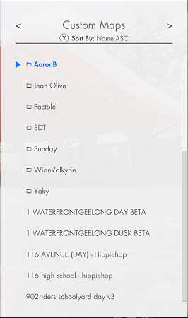

# XLMenuMod
The mod allows you to use subfolders within your Maps and Gear directories for SkaterXL!

As of the V3 beta, the Maps folder did not allow you to place maps in subdirectories at all.  The Gear folder allowed you to place gear in subdirectories, but wouldn't render it that way in game.

## Features

* Maps
  * This mod allows you to place your custom maps in any subdirectory structure you want (within Windows path limits), and will render that directory structure in the game's UI.
    * Any map that needs an additional DLL file with it for extensions, the mod expects the DLL to be in the same folder with the same name as the map file.
    * Compatible with (but somewhat replaces the need for) DawgVinci's Map Extension Mod.  Any extension DLLs only get loaded up if they aren't already loaded by another mod.
  * Sorting
    * The following sort methods are supported: Name ascending, name descending, filesize ascending, filesize descending, newest, and oldest.
      * For filesize sorting, a folder will be treated as the sum of it's contents.
      * For newest/oldest sorting, a folder will be treated as it's oldest/newest content.

    
* Gear
  * This mod allows you to place your custom gear in any subdirectory structure you want (within Windows path limits), and will render that directory structure in the game's UI.

  
## Options
* Pressing the B/O button to back out of a folder once you've selected it is enabled by default.  You can disable it in the mod settings.
* There's a setting to shrink down the default font size of the Gear/Maps lists.  By default, the font size is 36 which is a little large.  Currently you can set it to Normal (36), Small (30), Smaller (24). 
  * Note: Because of the way the game recycles list objects, it's recommended to set this value prior to entering the gear/maps menus OR to restart the game after setting this value.

